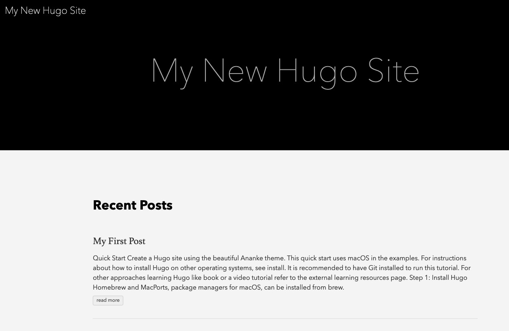
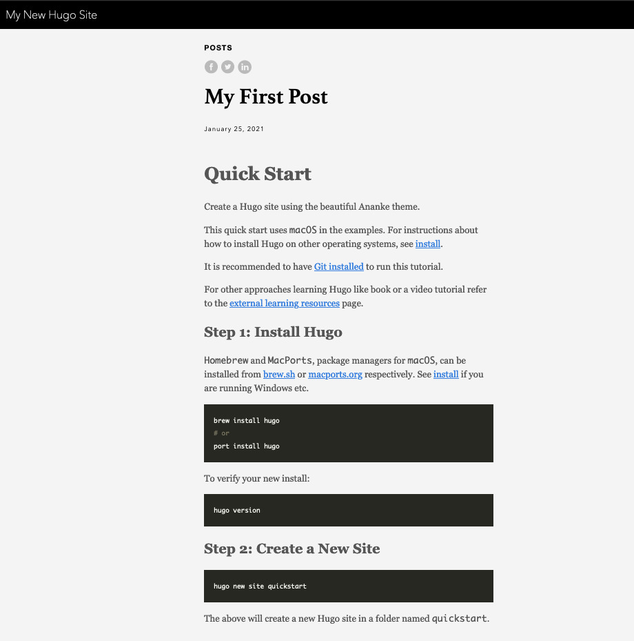

### The Kamehameha HugoLab/GettingStarted/quickstart Lab
---


```bash 

hugo new site quickstart && cd quickstart
git submodule add https://github.com/budparr/gohugo-theme-ananke.git themes/ananke
echo 'theme = "ananke"' >> config.toml
hugo new posts/my-first-post.md
hugo server -D && open http://localhost:1313

```

### Restult 



